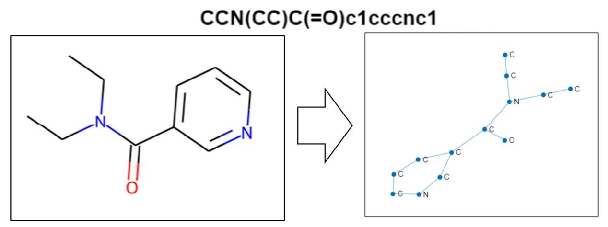

#  Convert SMILES to Molecular Graph

This simple example demonstrates how to use [RDKit](https://www.rdkit.org/) from [MATLAB](https://matlab.mathworks.com/)® for molecular structure processing. RDKit is licensed under [BSD 3-Clause License](https://github.com/rdkit/rdkit/blob/master/license.txt).

### Usage
Run this MATLAB Live Script: 
> MATLAB_Python_Convert_SMILES_to_Graph.mlx  

### RDKit Installation
RDKit can be installed easily by following the instructions from this [source](https://www.rdkit.org/docs/Install.html). Linux, Windows, and macOS RDKit platform wheels are available at the rdkit PyPi repository for all major Python versions. You can install RDKit using pip. 

>  $ pip install rdkit

Make sure to check versions of Python compatible with MATLAB products by release. This allows to build proper [MATLAB Interface to Python](https://www.mathworks.com/support/requirements/python-compatibility.html) 

The Python path is setup at the beginning of the MATLAB live script.
> pyenv("Version","C:\Users\...\python.exe");

### How it works
The code constructs the `adjacency matrix` of the molecular graph by converting the generated molecule object to pdb block and reading the `CONECT` records. 

The code extracts seven atomic properties from the given SMILES structure to construct the `feature matrix` including: atomic number, atomic mass, total atomic valance, atomic degree, number of hydrogens connected to the atom, atomic hybridization (“sp”, “sp2”, “sp3”), and whether or not the atom belongs to an aromatic ring. 

This example uses `molviewer` to visualize the molecular structure, which is shipped as part of MathWorks Bioinformatics toolbox. 

The output is saves as a MATLAB `.mat` file for further processing. One can then use Matlab's multiple built-in [Graph and Network Algorithms](https://www.mathworks.com/help/matlab/graph-and-network-algorithms.html) for graph structure analysis.

### References
[1] RDKit: Open-source cheminformatics; http://www.rdkit.org

